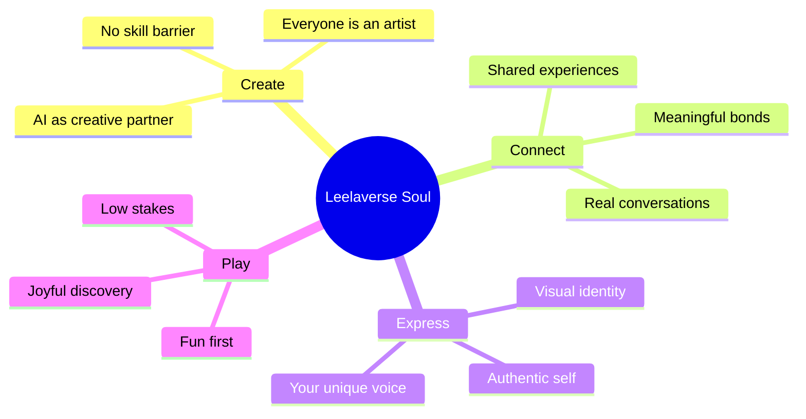
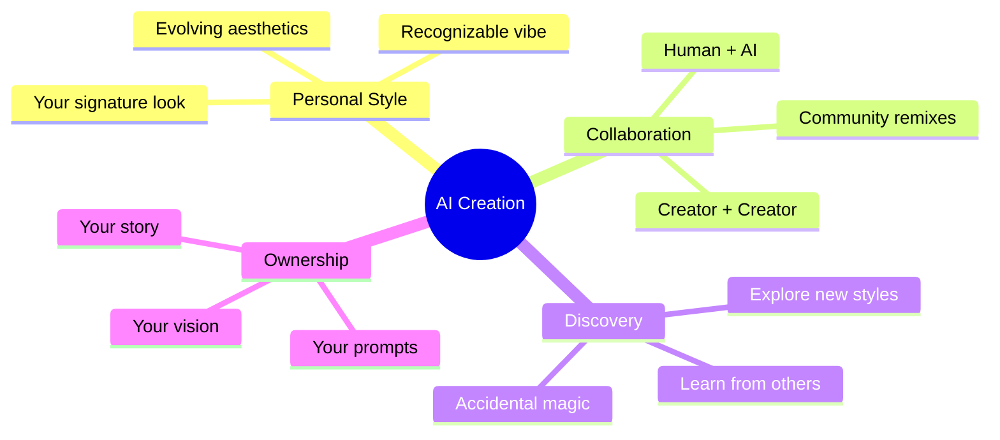
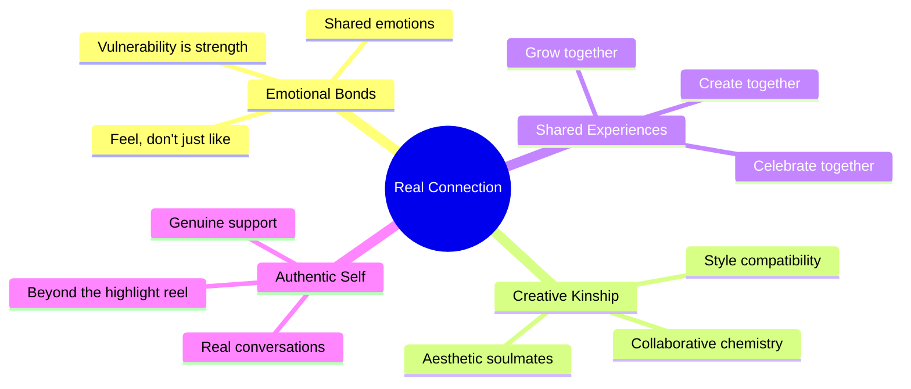
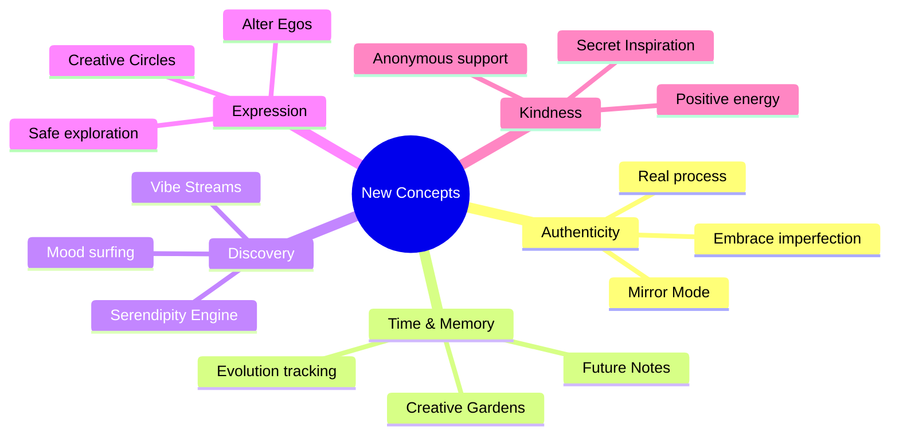
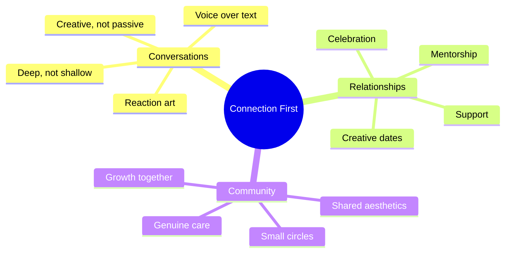

# 🌌 Leelaverse — Vision & Feature Concepts

> *Where AI Creation Meets Real Human Connection*

---

## 🧠 Core Philosophy

Leelaverse isn't just another social media app. It's a **creative playground** where AI amplifies human expression and authentic connections flourish. Every feature should answer: *"Does this help people create AND connect?"*

---

## 🎨 AI Creation Concepts

### The Remix Culture
- **Every AI creation tells a story** — users see the prompt journey
- **Remix chains** — build on each other's creativity like music sampling

### Ranking of creator ( something like pubg ranking )
--  reach , eangagement , or like share , remixes

 ### Ranking decides ( reward + badges)

### AI as Your Creative Partner
- **Vibe translator** — describe how you *feel*, AI creates what you *mean*
- **Creative challenges** — daily prompts that push boundaries
- **Style evolution** — AI learns your aesthetic over time
- **Happy accidents** — embrace and share unexpected results

---

## 💫 Real Connection Concepts

### Beyond Likes — Meaningful Interactions

**Soul Resonance** ( -- stand by -- )
- Not just "like" — express *how* something made you feel
- Emotional reactions: inspired, moved, curious, amused, peaceful
- Build connections based on emotional compatibility

**Creative Compatibility**
- Find people whose aesthetic resonates with yours
- Suggested connections based on creative style, not just follows
- "Your vibe attracts your tribe" — match by energy

**Shared Journeys**
- Create together in real-time, not just consume
- Collaborative canvases that become shared memories
- Duet content where two perspectives blend

**Stand by**
-

---

## 🌙 New Feature Concepts

### 🪞 Mirror Mode — Authentic Self-Expression
Show the process, not just the polish. Behind-the-scenes of your creative journey. Failed attempts, happy accidents, the real story.

### 🌊 Vibe Streams — Mood-Based Discovery
Browse by emotion, not algorithm. Feeling melancholic? Find others in that space. Feeling electric? Ride the high together. Music-inspired mood surfing.

### � Future Notes — Messages Through Time
Create for your future self or friends. Birthday surprises that wait patiently. Capsules that unlock on special dates. Anticipation as a feature.

### 🎭 Alter Egos — Safe Creative Exploration
Maintain multiple creative personas. Explore styles without judgment. Art accounts, chaos accounts, experimental spaces. Freedom to experiment.

### 🌱 Creative Gardens — Growth Visualization
Watch your style evolve over time. Your artistic journey as a living visualization. Milestones and metamorphosis. Celebrate growth, not just output.

### 💝 Secret Inspiration — Anonymous Appreciation
Send anonymous creative compliments. Reveal identity only if recipient wants. Spread positivity without ego. Kindness as currency.

### 🎪 Creative Circles — Intimate Communities
Small groups built around aesthetic vibes. Not massive followings — meaningful creative families. Quality over quantity connections.

### 🎲 Serendipity Engine — Happy Accidents
Random creative prompt partnerships. Unexpected collaborations. Chaos as creative fuel. Embrace the unplanned.

---

## � Connection-First Features

### Conversations That Matter
- **Deep prompts** — conversation starters beyond "hey"
- **Shared creation** — bond over making, not just messaging
- **Voice warmth** — audio feels more real than text
- **Reaction art** — respond to messages with quick AI creations

### Building Real Bonds
- **Creative dates** — virtual co-creation experiences
- **Mentor matching** — skilled creators guide newcomers
- **Celebration circles** — community hype for milestones
- **Grief spaces** — supportive communities for hard times

---

## 🌈 The Leelaverse Difference

| Old Social Media | Leelaverse |
|-----------------|------------|
| Consume content | Create together |
| Chase likes | Feel resonance |
| Perform perfection | Embrace process |
| Algorithmic discovery | Vibe-based matching |
| Massive following | Intimate circles |
| Compare and despair | Celebrate and inspire |
| Endless scroll | Meaningful moments |
| Addictive hooks | Joyful creation |

---

## 🌟 Guiding Principles

1. **Creation over consumption** — everyone is a creator
2. **Depth over breadth** — fewer real connections beat many shallow ones
3. **Process over product** — the journey matters as much as the result
4. **Emotion over engagement** — how people *feel* beats metrics
5. **Joy over addiction** — sustainable delight, not dopamine traps
6. **Authenticity over aesthetics** — real > perfect
7. **Kindness over clout** — community lifts everyone

---

## 🚀 The Vision

Leelaverse is where **AI unlocks creative potential** and **human connection gives it meaning**.

It's the app where you discover that you *are* creative, where you find your people, and where every interaction leaves you feeling more inspired than when you started.

*Not another place to scroll. A place to grow.*
