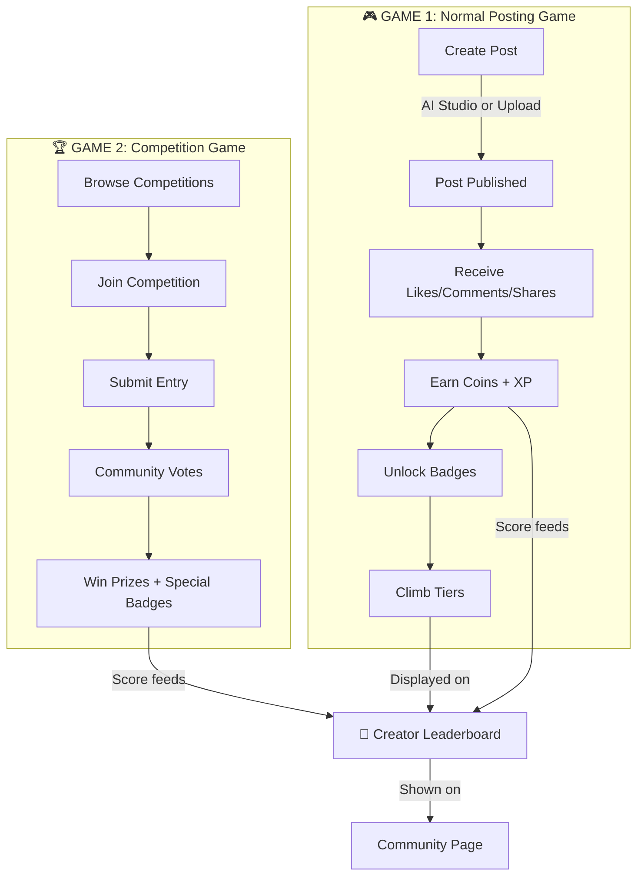
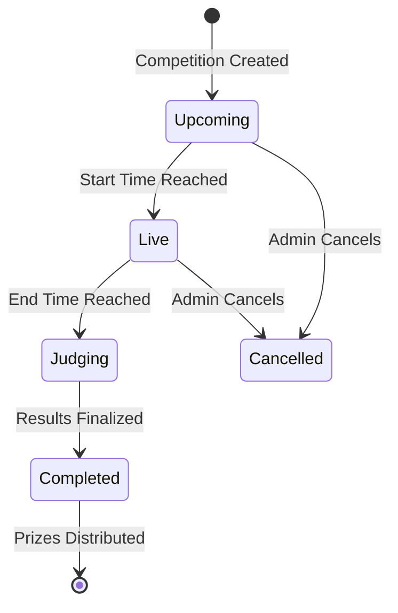
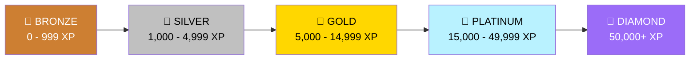
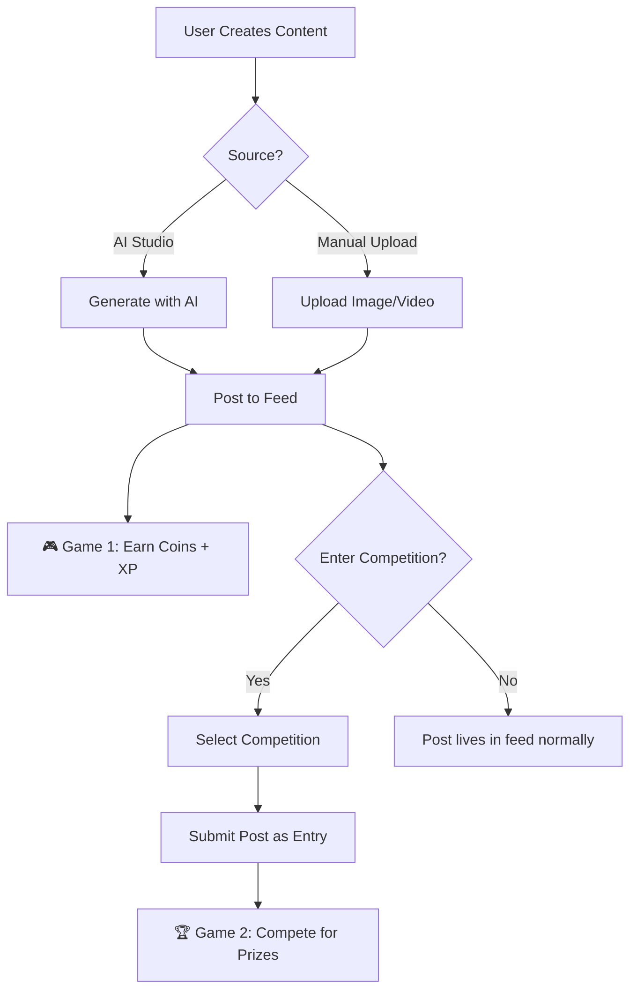
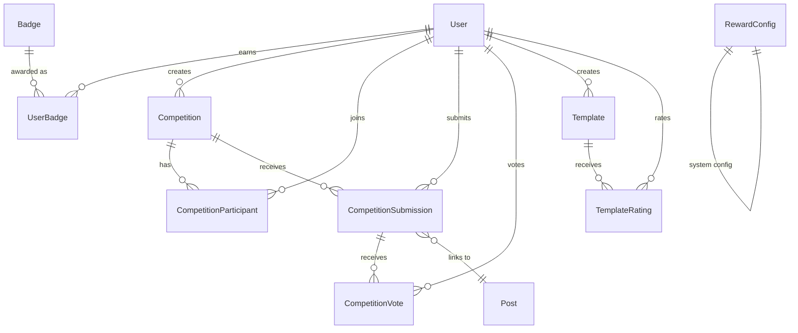
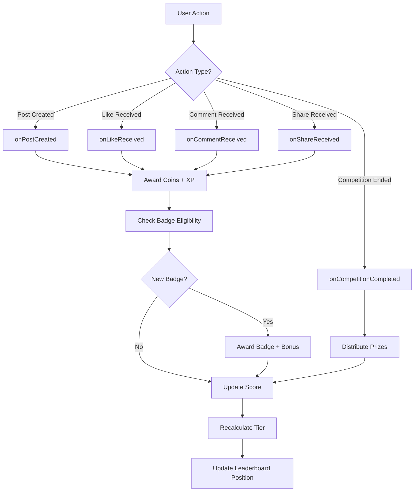

# 🌌 Leelaverse Community Feature — Architecture & Implementation Plan

> *Where AI Creation Meets Real Human Connection — The Competitive Layer*

---

## 🧠 Core Concept

The Community feature introduces **two interconnected game loops** that incentivize creation, engagement, and competition — turning Leelaverse from a creative tool into a **creative arena**.



---

## 🎮 Dual Game System

### Game 1: Normal Posting Game (Always-On)

Every creative action on the platform earns rewards:

| Action | Coins | XP | Notes |
|--------|-------|-----|-------|
| Create a post | +5 | +10 | AI or manual upload |
| Receive a like | +1 | +2 | Per like on your post |
| Receive a comment | +2 | +5 | Per comment on your post |
| Receive a share | +3 | +8 | Per share of your post |
| Post goes viral (100+ likes) | +25 | +50 | One-time bonus per post |
| Daily login | +3 | +5 | Once per day |
| Streak bonus | +1×days | +2×days | Multiplied by streak length |

### Game 2: Competition Game (Event-Driven)

Time-bound creative challenges with real prizes:



| Prize Position | Coins | Badge |
|---------------|-------|-------|
| 🥇 1st Place | From prize pool (configurable) | Gold Winner Badge |
| 🥈 2nd Place | From prize pool | Silver Badge |
| 🥉 3rd Place | From prize pool | Bronze Badge |
| Participant | +5 XP | Participation Badge |

---

## 🏅 Tier Progression System



| Tier | XP Range | Unlocks |
|------|----------|---------|
| 🥉 Bronze | 0 - 999 | Default starting tier |
| 🥈 Silver | 1,000 - 4,999 | "Rising Creator" badge |
| 🥇 Gold | 5,000 - 14,999 | "Established Creator" badge |
| 💎 Platinum | 15,000 - 49,999 | Can create competitions + "Elite Creator" badge |
| 👑 Diamond | 50,000+ | Featured on homepage + "Legendary Creator" badge |

---

## 📋 How Posting Works



**Key Insight**: Posts are created normally. Users can **optionally submit an existing post** to a competition. No separate posting flow needed.

---

## 🏗️ Database Schema

### New Models



### Model Details

#### 1. Badge (Admin-defined achievement definitions)
```
Badge
├── name (unique identifier: 'first_post', 'streak_7', etc.)
├── displayName ('First Creation', '7-Day Streak')
├── description
├── iconUrl
├── category ('posting', 'engagement', 'competition', 'milestone', 'special')
├── requirement (JSON: {type: 'post_count', value: 1})
├── coinReward (coins given when earned)
├── xpReward (XP given when earned)
├── rarity ('common', 'uncommon', 'rare', 'epic', 'legendary')
└── isActive
```

#### 2. Competition
```
Competition
├── creator → User (admin or verified creator)
├── title, description, rules, coverImage
├── category ('ai-art', 'storytelling', 'video', 'music')
├── submissionType ('image', 'video', 'text', 'any')
├── startsAt, endsAt
├── status ('upcoming', 'live', 'judging', 'completed', 'cancelled')
├── prizePool (total coins)
├── prizeBreakdown (JSON: {1st: 500, 2nd: 200, 3rd: 100})
├── prizeBadge (special badge for winners)
├── participantsCount, submissionsCount, votesCount
├── isFeatured, isTrending, isApproved
└── createdByRole ('admin' or 'creator')
```

#### 3. Template (Prompt templates for AI generation)
```
Template
├── creator → User
├── name, description, category
├── prompt (with [placeholders])
├── previewUrl, thumbnailUrl
├── aiModel, aspectRatio, style, negativePrompt
├── usageCount, rating, ratingCount
├── coinCost (0 = free)
├── isFeatured, isOfficial
└── tags[]
```

#### 4. RewardConfig (Admin-tunable reward rates)
```
RewardConfig
├── key ('post_created', 'like_received', etc.)
├── coinReward, xpReward
├── description
└── isActive
```

#### User Model Additions
```
User (existing + new fields)
├── creatorXP (total experience points)
├── creatorScore (composite leaderboard score)
├── creatorRank (global position)
├── creatorTier ('bronze' → 'diamond')
├── competitionsEntered, competitionsWon
├── currentStreak, longestStreak
├── lastPostDate
└── badges[] (earned badge identifiers)
```

---

## 🛠️ Backend Architecture

### Reward Engine (Core Service)



### API Endpoints

#### Community (Public)
| Method | Endpoint | Description |
|--------|----------|-------------|
| GET | `/api/community/leaderboard` | Ranked creators |
| GET | `/api/community/leaderboard/me` | My rank/stats |
| GET | `/api/community/competitions` | List competitions |
| GET | `/api/community/competitions/:id` | Competition details |
| POST | `/api/community/competitions/:id/join` | Join competition |
| POST | `/api/community/competitions/:id/submit` | Submit entry |
| POST | `/api/community/competitions/:id/vote/:subId` | Vote |
| GET | `/api/community/templates` | List templates |
| POST | `/api/community/templates/:id/use` | Use template |
| POST | `/api/community/templates/:id/rate` | Rate template |
| GET | `/api/community/badges` | All badges |
| GET | `/api/community/badges/my` | My badges |

#### Community (Creator — Verified Users)
| Method | Endpoint | Description |
|--------|----------|-------------|
| POST | `/api/community/competitions` | Create competition |
| POST | `/api/community/templates` | Create template |

#### Admin Community Panel
| Method | Endpoint | Description |
|--------|----------|-------------|
| GET | `/api/admin/community/stats` | Dashboard stats |
| CRUD | `/api/admin/community/competitions` | Manage competitions |
| POST | `/api/admin/community/competitions/:id/finalize` | Distribute prizes |
| CRUD | `/api/admin/community/badges` | Manage badges |
| CRUD | `/api/admin/community/templates` | Manage templates |
| GET/PUT | `/api/admin/community/rewards` | Tune reward rates |

---

## 🎨 Frontend Architecture

### Community Page (3-Panel Layout)

```
┌─────────────────────────────────────────────────────────┐
│                      Navbar                              │
├──────────────┬──────────────────┬────────────────────────┤
│  LEADERBOARD │   COMPETITIONS   │      TEMPLATES         │
│              │                  │                        │
│  🔍 Search   │  🔍 Search       │  🔍 Search             │
│  [Filters]   │  [Live|Upcoming] │  [Trending|Rated]      │
│              │                  │                        │
│  👑 #1 User  │  🎨 Cyberpunk    │  ┌────┐ ┌────┐        │
│  🥈 #2 User  │     Legends      │  │    │ │    │        │
│  🥇 #3 User  │  ⏰ 15H:20m      │  │ T1 │ │ T2 │        │
│  ──────────  │  👥 1.5k         │  └────┘ └────┘        │
│  My: #100    │  [Participate]   │  ┌────┐ ┌────┐        │
│  ──────────  │                  │  │ T3 │ │ T4 │        │
│  #221 User   │  🌌 Celestial    │  └────┘ └────┘        │
│              │     Voyages      │                        │
└──────────────┴──────────────────┴────────────────────────┘
```

### Admin Community Panel (6 Tabs)

```
┌─────────────────────────────────────────────────────────┐
│  Admin Community Management                              │
├──────────────────────────────────────────────────────────┤
│  [Dashboard] [Competitions] [Badges] [Templates]         │
│  [Rewards]   [Leaderboard]                               │
├──────────────────────────────────────────────────────────┤
│                                                          │
│  Tab Content Area                                        │
│  (Stats cards, data tables, forms)                       │
│                                                          │
└──────────────────────────────────────────────────────────┘
```

### Tech Stack
- **React** + **Redux Toolkit** (state management)
- **Tailwind CSS v4** (styling)
- **Framer Motion** (animations)
- **React Icons** (icon library)

---

## 📁 File Structure

```
backend/
├── prisma/
│   ├── schema.prisma          # +8 new models
│   └── seed-community.js      # Seed data
├── src/
│   ├── controllers/
│   │   ├── communityController.js  # NEW
│   │   └── adminController.js      # MODIFIED
│   ├── routes/
│   │   ├── communityRoutes.js      # NEW
│   │   └── adminRoutes.js          # MODIFIED
│   ├── services/
│   │   └── rewardEngine.js         # NEW
│   └── models/
│       └── index.js                # MODIFIED

Leelaah-frontend/
├── src/
│   ├── components/
│   │   ├── Community/
│   │   │   ├── Community.jsx       # MODIFIED (full refactor)
│   │   │   └── Community.css       # MODIFIED
│   │   └── AdminCommunity/
│   │       ├── AdminCommunity.jsx  # NEW
│   │       └── AdminCommunity.css  # NEW
│   ├── store/
│   │   ├── slices/
│   │   │   └── communitySlice.js   # NEW
│   │   └── store.js                # MODIFIED
│   ├── services/
│   │   └── api.js                  # MODIFIED
│   └── App.jsx                     # MODIFIED
```

---

## 🚀 Implementation Phases

### Phase 1: Database
- Add new models to schema.prisma
- Run migration
- Seed badges + reward configs

### Phase 2: Backend Core
- Implement RewardEngine service
- Implement communityController
- Wire up routes
- Hook rewards into existing controllers

### Phase 3: Backend Admin
- Extend adminController
- Add admin community routes

### Phase 4: Frontend State
- Create communitySlice
- Add API service methods

### Phase 5: Frontend UI
- Refactor Community.jsx (Tailwind + Framer Motion)
- Build AdminCommunity panel

### Phase 6: Testing & Polish
- End-to-end testing
- Mobile responsive
- Dark/light theme verification

---

*Built with 🌌 Leelaverse philosophy: Creation over consumption, depth over breadth, joy over addiction.*
